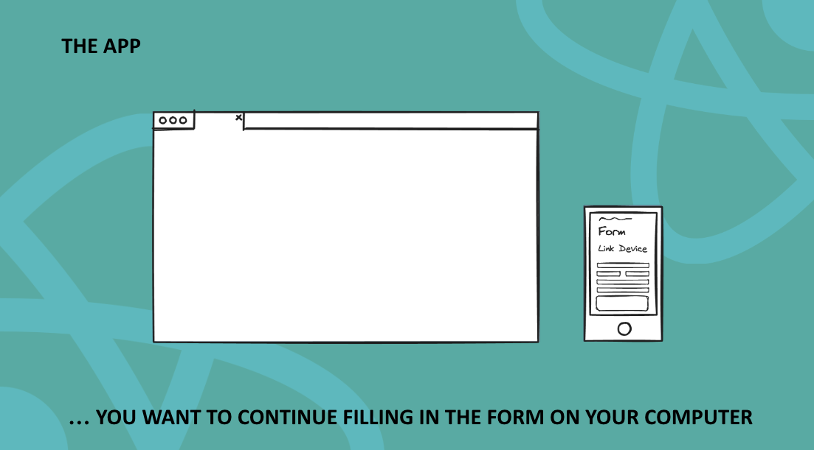
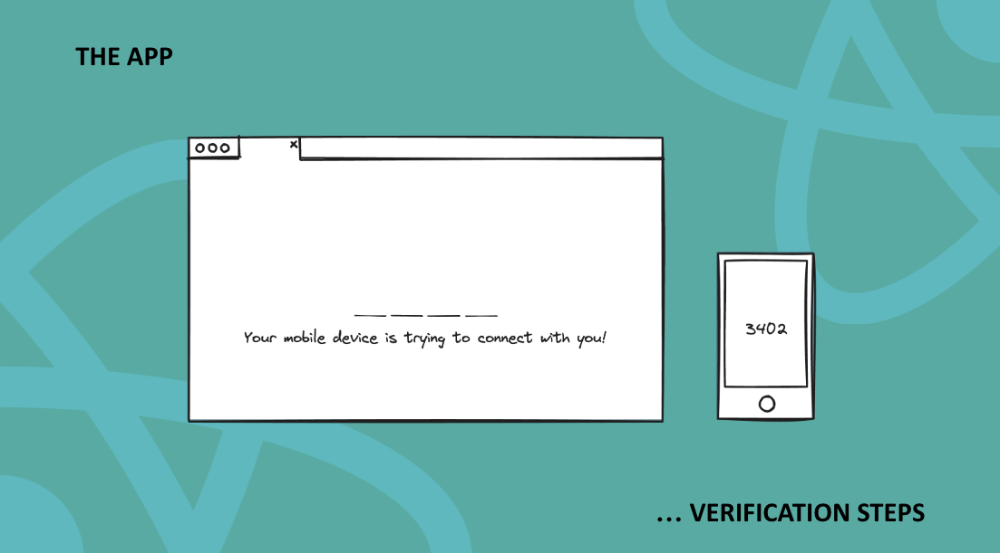
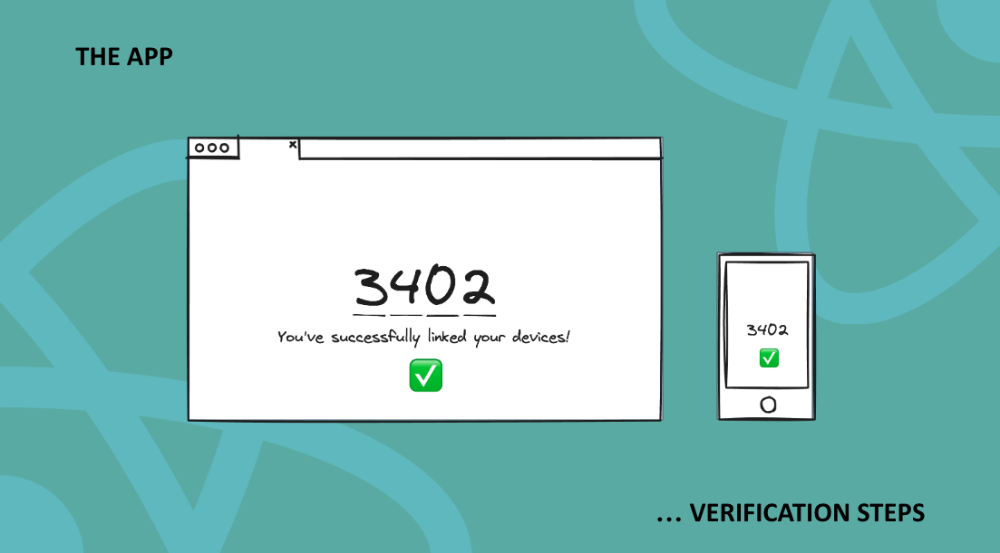
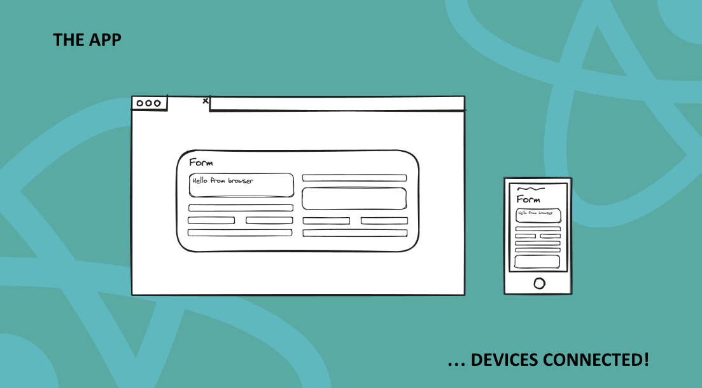
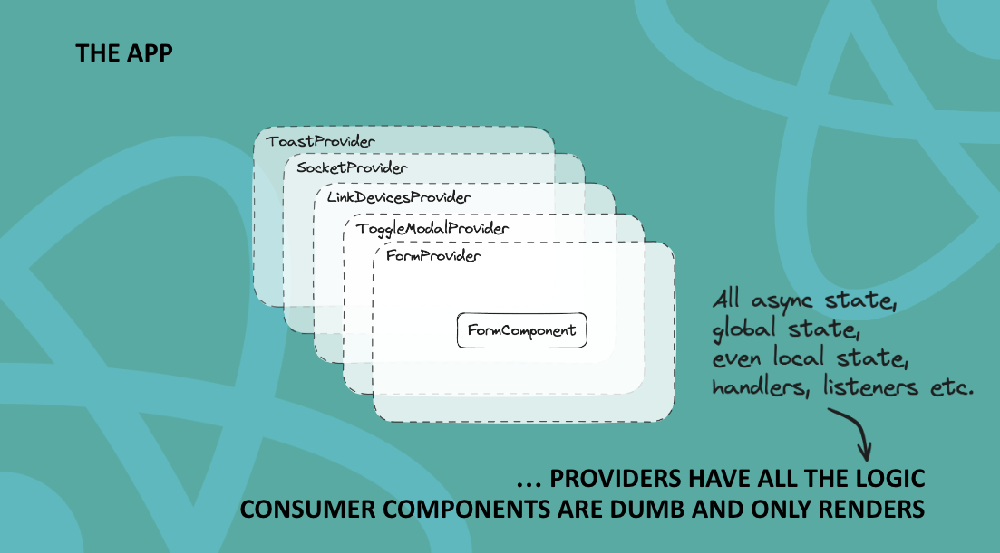

# LINK DEVICES

How to link two devices together using React, Context API and the design pattern of providers.

## Content
### The Idea of the Project
### The Result of the Project
### The Architecture
### Setup

## The Idea of the Project





## The Result of the Project


## The Architecture





## Setup
1. Clone this repository and check the requirements via engines field of package.json.
2. Install dependencies using npm install in ```server``` folder and ```browser``` folder.
3. Run the server using ```cd server && npm start``` and run two clients using ```cd browser && npm start```. The second time you run the client, you will be asked to run on a different port, say yes. 
4. Now you have two clients running. Open both localhosts by visiting ```http://localhost:PORT/```. Once both are open, click on "Link devices"

